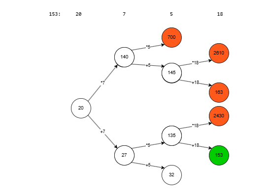

# Řešení úkolu na letní stáž v Edhouse

Řešitel: Jan Krahula

Varianta C#

## Popis algoritmu

Program si ze vstupního řetězce vytvoří List<long>, například z '153: 20 7 5 18' udělá [153, 20, 7, 5, 18]. 
Poté si vytvoří frontu, do které vloží první prvek za :, tady by to bylo 20. Následující algoritmus běží, dokud fronta není prázdná nebo se nenašlo požadované číslo:

- Pro všechny prvky P momentálně ve frontě:
- Vynásob P dalším prvkem ze vstupu. Pokud je výsledek menší než požadované číslo, přidej ho do fronty.
- Sečti P s dalším prvkem ze vstupu. Pokud je výsledek menší než požadované číslo, přidej ho do fronty.
- Pokud je se jeden z výsledků rovná požadovanému číslu a zárověň je iterátor na konci vstupního listu, přičti k výslednému číslu to požadované

Ilustrace:

Okamžitý stav fronty je zde znázorněn vertikálně, kdy se berou prvky z vrchu dolů, a dále se expandují.
